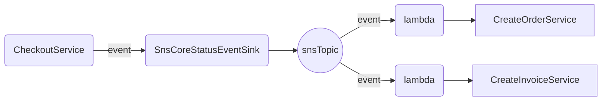

# BaseLib.Core.AmazonCloud

## Overview

Contains concrete implementations of the interfaces from **BaseLib.Core** for Amazon AWS 

## Services

### Event support

**SnsCoreStatusEventSink** is an implementation of the **ICoreStatusEventSink** interface, providing support for event-driven choreography between services. 

In the example below, once the CheckoutService completes its process, it writes an event to the EventSink. The event sink then publishes this event to an SNS Topic. This topic has two Lambda subscribers which, upon receiving the event, execute the **CreateOrderService** and **CreateInvoiceServices**, respectively.

### Secrets Vault

the ***ICoreSecretsVault*** is the BaseLib.Core application abstraction of a vault that keeps safe sensitive information such as credentials and API keys to connect to other systems.

 The AmazonSecretsVault is the implementation on top of AWS Secret Manager.
