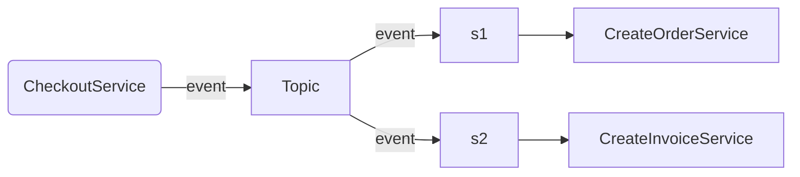

# BaseLib.Core

## Overview
`BaseLib.Core` is a foundational library for building backend services in .NET. It simplifies the creation of services by providing base classes that implement common patterns and functionalities.

BaseLib.Core services are platform-agnostic, meaning  they can run in various environments, such as containers, Azure Functions, or AWS Lambdas.

## Key Concepts

### The Service Class
A service represents a single backend operation and follows a  Request/Response pattern.

### Request
Requests are derived from `CoreRequestBase`.

Example:

```csharp
public class CheckoutRequest : CoreRequestBase
{
    public int CustomerId { get; set; }
    public string CustomerName { get; set; }
    public string IdentificationNumber { get; set; }
    public CreditCard? CreditCard { get; set; }
    public Product[] Items{ get; set; }
}
```

### Response
Responses are derived from CoreResponseBase and contain a Succeeded property to indicate success. 

Example:

```csharp
public class CheckoutResponse : CoreResponseBase
{
    public long OrderId { get; set; }
}
```

### Service Implementation
Services inherit from `CoreServiceBase<TRequest,TResponse>`, where TRequest and TResponse are your custom request and response types. The core logic is implemented in the RunAsync() method. 

Example:

```csharp
public class CheckoutService : CoreServiceBase<CheckoutRequest, CheckoutResponse>
{
    protected override async Task<CheckoutResponse> RunAsync()
    {
        // Implementation logic here...
        var order = await CreateOrderAsync(this.Request.CustomerId, this.Request.Items);
        return new CheckoutResponse { Succeeded = true, OrderId = order.Id };
    }
}
```

### Reason codes
Responses include a **ReasonCode**, which consists of an integer value and a string description.

The ReasonCode can be assigned from Enum types. It maps the integer value from the enum's integer value and the description from the Description attribute, if present; otherwise, it uses the label of the enum value.

This approach offers a convenient way to handle Reason Codes as enums within the application.

Example:

```csharp
enum EcommerceReasonCode
{
    [Description("Product is not available at this time")]
    NoItemsAvailable = 10448
}


public class CheckoutService : CoreServiceBase<CheckoutRequest, CheckoutResponse>
{
    protected override async Task<CheckoutResponse> RunAsync()
    {
        if (!CheckForAvailability(this.Request.Products))
        {
            return new CheckoutResponse
            {
                Succeeded = false,
                ReasonCode = EcommerceReasonCode.NoItemsAvailable
            };
        }
        // Implementation logic here...
    }
}

```
### Events Support

The **ICoreStatusEventSink** interface provides support for event-driven choreography between services. This capability enables the asynchronous triggering of actions in response to events.

A typical implementation of **ICoreStatusEventSink** publishes the event to an external publish/subscribe messaging system, subscribers of the messaging system will react to events published by the service.

In the diagram below, a CheckoutService publish an event to a Topic on a messaging system. The subscribers of this Topic receive the events and subsequently execute the 'create order' and 'create invoice' services, respectively.



Service required to report events need to use the build in constructor passing the ICoreStatusEventSink. 

Example:

```csharp
public class CheckoutService : CoreServiceBase<CheckoutRequest, CheckoutResponse>
{

    // A Constructor with the eventsink
    public CheckoutService(ICoreStatusEventSink? eventsink)
        : base(eventSink: eventsink)
    {

    }

    // Implementation Logic here...
}
```


